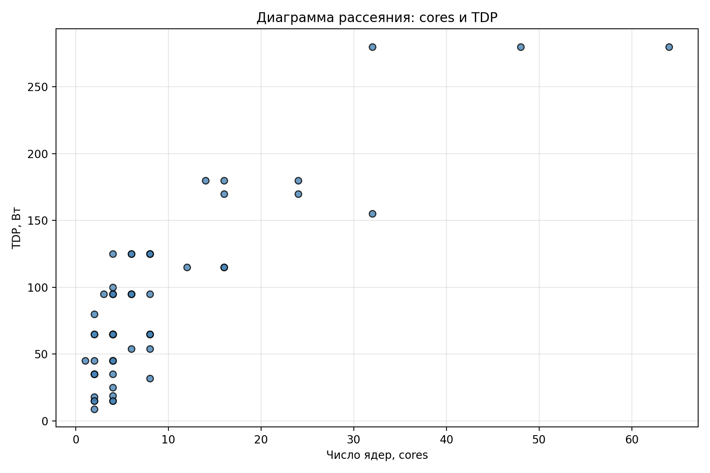
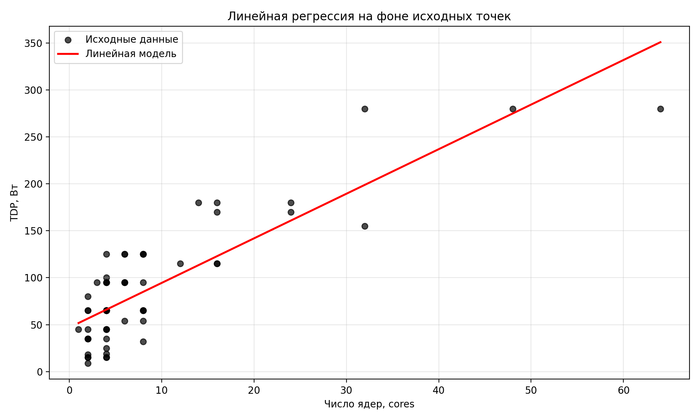
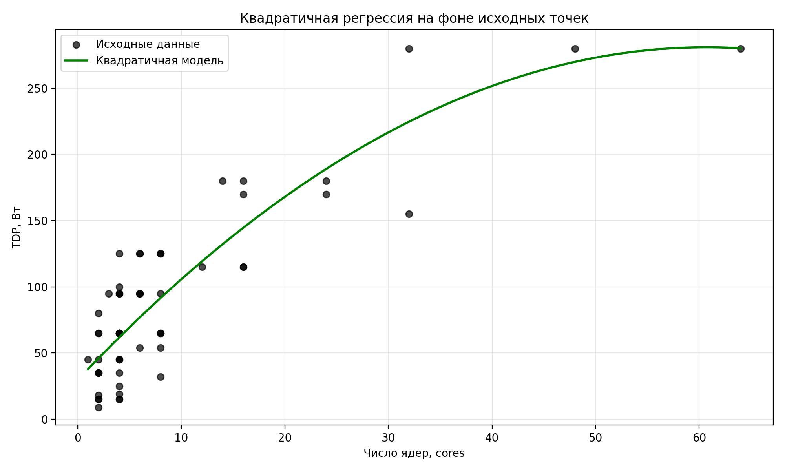
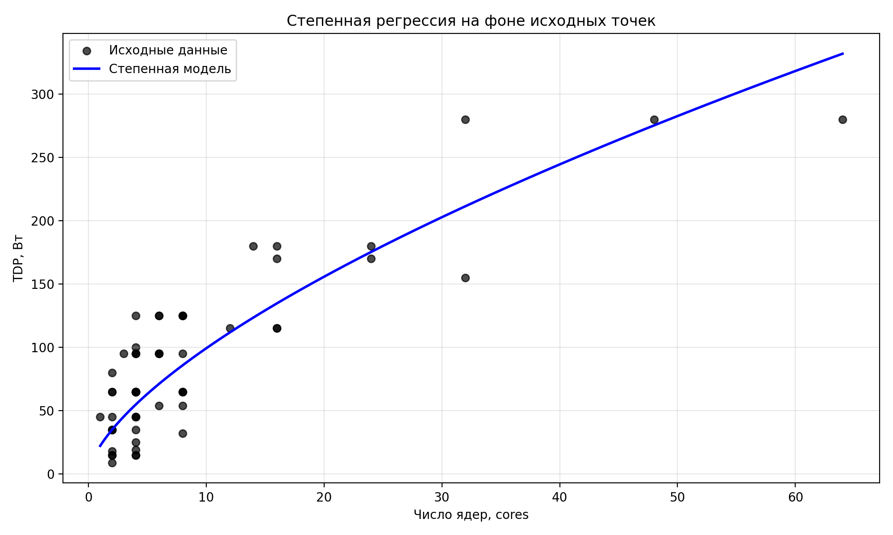
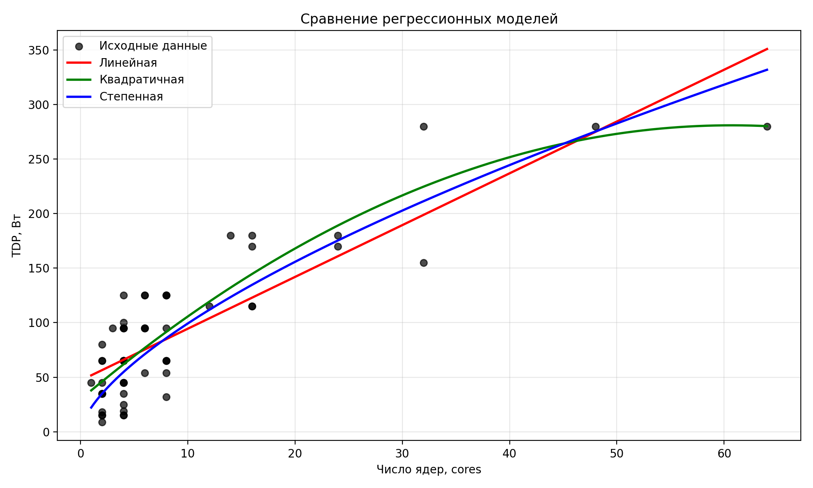
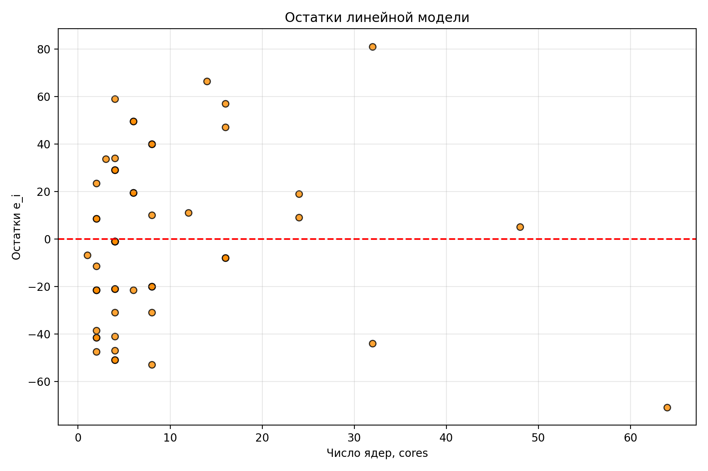
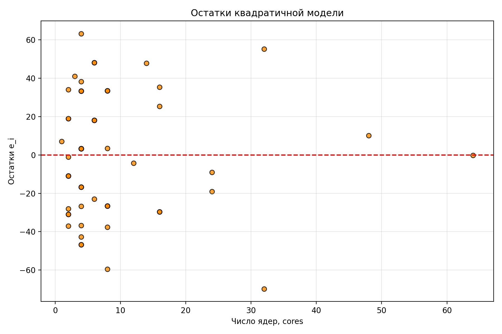
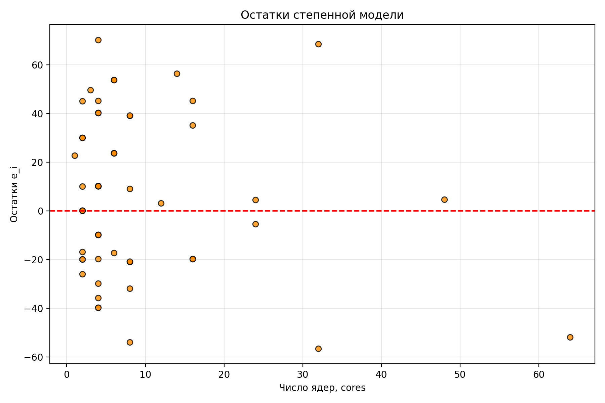

# РГР №3. Регрессионные модели и их интерпретация

## Вариант C-6

Тема работы — построение и сравнение регрессионных моделей зависимости результативного признака от одного фактора.

Цель работы — оценить функцию регрессии, сравнить несколько моделей зависимости TDP процессора от числа ядер и выбрать модель, наиболее подходящую для прогноза.

В работе рассматриваются три модели:

1. линейная модель;
2. квадратичная модель;
3. степенная модель как дополнительная модель варианта C-6.

---

## 1. Исходные данные

В работе используется набор данных `openintro::cpu`.

Срез данных: процессоры компании AMD.

Количество наблюдений:

$$
n = 60
$$

Факторный признак:

$$
x
$$

— число ядер процессора (`cores`).

Результативный признак:

$$
y
$$

— теплопакет процессора, TDP, Вт.

Прогнозное значение фактора:

$$
x^* = 20
$$

То есть требуется спрогнозировать TDP для процессора AMD с 20 ядрами.

---

## 2. Первичный анализ данных

Первые строки таблицы:

| № | x | y |
|---:|---:|---:|
| 1 | 1 | 45 |
| 2 | 2 | 65 |
| 3 | 2 | 9 |
| 4 | 2 | 15 |
| 5 | 2 | 35 |

Базовые характеристики выборки:

| Показатель | Значение |
|---|---:|
| Количество наблюдений, $n$ | 60 |
| $\sum x_i$ | 528 |
| $\sum y_i$ | 5326 |
| $\overline{x}$ | 8.8000 |
| $\overline{y}$ | 88.7667 |
| $x_{\min}$ | 1 |
| $x_{\max}$ | 64 |
| $y_{\min}$ | 9 |
| $y_{\max}$ | 280 |

Среднее число ядер равно:

$$
\overline{x} = 8.8000
$$

Средний TDP равен:

$$
\overline{y} = 88.7667
$$

---

## 3. Диаграмма рассеяния и предварительная гипотеза

По диаграмме рассеяния можно предположить, что между числом ядер процессора и TDP существует положительная зависимость: при увеличении числа ядер теплопакет процессора в среднем возрастает.

При этом точки не лежат строго на одной прямой. Для одинакового числа ядер встречаются разные значения TDP. Это означает, что теплопакет зависит не только от числа ядер, но также от архитектуры, поколения процессора, частоты, класса устройства и других характеристик.

Поэтому для описания зависимости сравниваются три модели: линейная, квадратичная и степенная.

---

## 4. Линейная модель

Линейная модель имеет вид:

$$
\hat y = a + bx
$$

где:

- $x$ — число ядер процессора;
- $\hat y$ — прогнозируемое значение TDP;
- $a$ — свободный коэффициент;
- $b$ — коэффициент при факторе $x$.

Оценки коэффициентов линейной регрессии находятся методом наименьших квадратов:

$$
\hat b = \frac{S_{xy}}{S_{xx}},
\qquad
\hat a = \overline{y} - \hat b\overline{x}
$$

где

$$
S_{xx} = \sum_{i=1}^n (x_i - \overline{x})^2,
\qquad
S_{xy} = \sum_{i=1}^n (x_i - \overline{x})(y_i - \overline{y}).
$$

По данным:

$$
S_{xx} = 7483.6000,
\qquad
S_{xy} = 35533.2000.
$$

Тогда

$$
\hat b = \frac{35533.2000}{7483.6000} = 4.7481
$$

и

$$
\hat a = 88.7667 - 4.7481\cdot 8.8000 = 46.9830.
$$

Итоговое уравнение линейной регрессии:

$$
\hat y = 46.9830 + 4.7481x
$$

Коэффициент $b$ положительный. Это означает, что при увеличении числа ядер на 1 TDP в среднем увеличивается примерно на 4.7481 Вт.

График линейной модели на фоне исходных данных:

### Качество линейной модели

Остаток для каждого наблюдения:

$$
e_i = y_i - \hat y_i
$$

Остаточная сумма квадратов:

$$
RSS = \sum_{i=1}^n e_i^2
$$

Общая сумма квадратов:

$$
TSS = \sum_{i=1}^n (y_i - \overline{y})^2
$$

Коэффициент детерминации:

$$
R^2 = 1 - \frac{RSS}{TSS}
$$

Средняя ошибка аппроксимации рассчитывалась по формуле:

$$
A = \frac{100\%}{n}\sum_{i=1}^{n}\left|\frac{y_i-\hat{y}_i}{y_i}\right|
$$

Для линейной модели:

| Показатель | Значение |
|---|---:|
| $RSS$ | 69634.0325 |
| $TSS$ | 238350.7333 |
| $R^2$ | 0.7079 |
| $A$ | 65.5857% |

Линейная модель объясняет примерно 70.79% изменчивости TDP. Однако средняя ошибка аппроксимации достаточно велика. Это связано с тем, что в данных есть малые значения $y$, для которых даже умеренная абсолютная ошибка даёт большую относительную ошибку в процентах.

---

## 5. Квадратичная модель

Квадратичная модель имеет вид:

$$
\hat y = a + bx + cx^2
$$

Эта модель позволяет учитывать возможную нелинейность связи между числом ядер и TDP.

Для нахождения коэффициентов используется метод наименьших квадратов. Система нормальных уравнений:

$$
\begin{cases}
na + b\sum x_i + c\sum x_i^2 = \sum y_i,\\
a\sum x_i + b\sum x_i^2 + c\sum x_i^3 = \sum x_iy_i,\\
a\sum x_i^2 + b\sum x_i^3 + c\sum x_i^4 = \sum x_i^2y_i.
\end{cases}
$$

По данным:

| Сумма | Значение |
|---|---:|
| $n$ | 60 |
| $\sum x_i$ | 528 |
| $\sum x_i^2$ | 12130 |
| $\sum x_i^3$ | 494076 |
| $\sum x_i^4$ | 25217650 |
| $\sum y_i$ | 5326 |
| $\sum x_iy_i$ | 82402 |
| $\sum x_i^2y_i$ | 2730540 |

После решения системы получены коэффициенты:

$$
a = 29.7140,
\qquad
b = 8.2768,
\qquad
c = -0.0682.
$$

Итоговое уравнение квадратичной модели:

$$
\hat y = 29.7140 + 8.2768x - 0.0682x^2
$$

Коэффициент при $x$ положительный, поэтому при увеличении числа ядер TDP в среднем возрастает. Коэффициент при $x^2$ отрицательный, поэтому парабола направлена вниз. Это показывает, что рост TDP при увеличении числа ядер не является строго линейным.

График квадратичной модели на фоне исходных данных:

### Качество квадратичной модели

| Показатель | Значение |
|---|---:|
| $RSS$ | 57000.4473 |
| $TSS$ | 238350.7333 |
| $R^2$ | 0.7609 |
| $A$ | 58.1309% |

Квадратичная модель объясняет примерно 76.09% изменчивости TDP. По сравнению с линейной моделью значение $R^2$ увеличилось, а $RSS$ и средняя ошибка аппроксимации уменьшились.

---

## 6. Степенная модель

Дополнительная модель для варианта C-6 — степенная:

$$
\hat y = ax^b
$$

Для оценки параметров используется линеаризация. Прологарифмируем обе части:

$$
\ln y = \ln a + b\ln x
$$

Вводим обозначения:

$$
X = \ln x,
\qquad
Y = \ln y,
\qquad
A = \ln a.
$$

Тогда модель принимает линейный вид:

$$
Y = A + bX
$$

Логарифмирование допустимо, так как во всех наблюдениях $x > 0$ и $y > 0$.

По данным после линеаризации получены коэффициенты:

$$
A = 3.1006,
\qquad
b = 0.6502.
$$

Так как $A = \ln a$, то

$$
a = e^A = e^{3.1006} = 22.2110.
$$

Итоговая степенная модель:

$$
\hat y = 22.2110x^{0.6502}
$$

Показатель степени положительный, поэтому модель отражает положительную зависимость между числом ядер и TDP. Так как $0 < b < 1$, рост TDP происходит с замедляющимся темпом.

График степенной модели на фоне исходных данных:

### Качество степенной модели

| Показатель | Значение |
|---|---:|
| $RSS$ | 62868.6927 |
| $TSS$ | 238350.7333 |
| $R^2$ | 0.7362 |
| $A$ | 50.6625% |

Степенная модель объясняет примерно 73.62% изменчивости TDP. По средней ошибке аппроксимации она оказалась лучше линейной и квадратичной моделей, но по $R^2$ уступает квадратичной модели.

---

## 7. Сравнение моделей

Для сравнения моделей используются следующие показатели:

- $RSS$ — остаточная сумма квадратов, показывает общий размер ошибок модели;
- $R^2$ — коэффициент детерминации, показывает долю изменчивости $y$, объяснённую моделью;
- $A$ — средняя ошибка аппроксимации, показывает среднюю относительную ошибку в процентах;
- графики остатков — позволяют проверить, есть ли систематические отклонения.

Сравнительная таблица:

| Модель | Уравнение | $RSS$ | $R^2$ | $A$ |
|---|---|---:|---:|---:|
| Линейная | $\hat y = 46.9830 + 4.7481x$ | 69634.0325 | 0.7079 | 65.5857% |
| Квадратичная | $\hat y = 29.7140 + 8.2768x - 0.0682x^2$ | 57000.4473 | 0.7609 | 58.1309% |
| Степенная | $\hat y = 22.2110x^{0.6502}$ | 62868.6927 | 0.7362 | 50.6625% |

Общий график трёх моделей:

По коэффициенту детерминации лучшей является квадратичная модель:

$$
R^2_{quad} = 0.7609
$$

Она объясняет наибольшую долю изменчивости TDP и имеет наименьшее значение $RSS$.

По средней ошибке аппроксимации лучшей является степенная модель:

$$
A_{power} = 50.6625\%
$$

Однако итоговый выбор нельзя делать только по одному показателю. В качестве основной модели для прогноза выбирается квадратичная модель, потому что она имеет максимальный $R^2$ и минимальный $RSS$, то есть лучше всего описывает общий разброс данных.

Большие значения средней ошибки аппроксимации у всех моделей объясняются сильным разбросом данных и наличием малых значений $y$. При малых значениях $y$ даже небольшая абсолютная ошибка превращается в большую относительную ошибку в процентах.

---

## 8. Анализ остатков

Остатки показывают, насколько фактические значения отличаются от прогнозных:

$$
e_i = y_i - \hat y_i
$$

Если модель хорошо описывает данные, остатки не должны иметь явной систематической структуры.

### Остатки линейной модели

Для линейной модели остатки достаточно разбросаны. Это показывает, что линейная модель отражает общий тренд, но не полностью описывает структуру данных.

### Остатки квадратичной модели

У квадратичной модели остаточная сумма квадратов меньше, чем у линейной модели. Это означает, что парабола в среднем проходит ближе к исходным точкам.

### Остатки степенной модели

Степенная модель даёт меньшую среднюю ошибку аппроксимации, но по $RSS$ и $R^2$ уступает квадратичной модели.

---

## 9. Подробный статистический анализ линейной модели

Для линейной модели проводится отдельный статистический анализ, так как по заданию РГР необходимо проверить значимость коэффициента при факторе $x$ и построить доверительные интервалы для коэффициентов.

Итоговая линейная модель:

$$
\hat y = 46.9830 + 4.7481x
$$

Остаточная сумма квадратов:

$$
RSS = 69634.0325
$$

Несмещённая оценка дисперсии ошибки:

$$
s^2 = \frac{RSS}{n - 2}
$$

$$
s^2 = \frac{69634.0325}{60 - 2} = 1200.5868
$$

Среднее остаточное отклонение:

$$
s = \sqrt{s^2} = 34.6495
$$

### Стандартные ошибки коэффициентов

Стандартная ошибка коэффициента наклона:

$$
SE(\hat b) = \frac{s}{\sqrt{S_{xx}}}
$$

$$
SE(\hat b) = \frac{34.6495}{\sqrt{7483.6000}} = 0.4005
$$

Стандартная ошибка свободного коэффициента:

$$
SE(\hat a) = s\sqrt{\frac{1}{n} + \frac{\overline{x}^2}{S_{xx}}}
$$

$$
SE(\hat a) = 5.6950
$$

Для 95% доверительных интервалов используется квантиль распределения Стьюдента:

$$
t_{0.975;58} = 2.0017
$$

### 95% доверительный интервал для коэффициента $a$

$$
\hat a \pm t \cdot SE(\hat a)
$$

$$
46.9830 \pm 2.0017\cdot 5.6950
$$

$$
a \in [35.5832;\ 58.3829]
$$

### 95% доверительный интервал для коэффициента $b$

$$
\hat b \pm t \cdot SE(\hat b)
$$

$$
4.7481 \pm 2.0017\cdot 0.4005
$$

$$
b \in [3.9464;\ 5.5499]
$$

Доверительный интервал для $b$ не содержит ноль. Это означает, что коэффициент при $x$ статистически значим на уровне значимости $\alpha = 0.05$.

### Проверка гипотезы о значимости коэффициента при $x$

Проверяются гипотезы:

$$
H_0: b = 0
$$

$$
H_1: b \ne 0
$$

Наблюдаемое значение статистики Стьюдента:

$$
t_{набл} = \frac{\hat b}{SE(\hat b)}
$$

$$
t_{набл} = \frac{4.7481}{0.4005} = 11.8545
$$

Критическое значение:

$$
t_{кр} = 2.0017
$$

Так как

$$
|t_{набл}| = 11.8545 > 2.0017 = t_{кр},
$$

нулевая гипотеза $H_0$ отвергается. Следовательно, коэффициент при $x$ статистически значим, и связь между числом ядер и TDP в линейной модели является статистически подтверждённой.

---

## 10. Прогноз при $x^* = 20$

Получим прогноз TDP для процессора AMD с 20 ядрами.

### Линейная модель

$$
\hat y(20) = 46.9830 + 4.7481\cdot 20 = 141.9459
$$

### Квадратичная модель

$$
\hat y(20) = 29.7140 + 8.2768\cdot 20 - 0.0682\cdot 20^2 = 167.9790
$$

### Степенная модель

$$
\hat y(20) = 22.2110\cdot 20^{0.6502} = 155.7706
$$

Сравнение прогнозов:

| Модель | Прогноз $\hat y(20)$, Вт |
|---|---:|
| Линейная | 141.9459 |
| Квадратичная | 167.9790 |
| Степенная | 155.7706 |

В качестве основной модели для прогноза выбрана квадратичная модель, так как она имеет наибольшее значение $R^2$ и наименьшее значение $RSS$ среди трёх моделей.

Итоговый прогноз:

$$
\hat y(20) = 167.9790
$$

Содержательно это означает, что для процессора AMD с 20 ядрами модель прогнозирует TDP примерно 167.98 Вт.

---

## 11. Итоговый вывод

В работе исследовалась зависимость теплопакета процессора AMD от числа ядер на основе среза данных `openintro::cpu`. В качестве факторного признака использовалось число ядер $x$, а в качестве результативного признака — TDP $y$.

По диаграмме рассеяния была выдвинута гипотеза о положительной зависимости: при увеличении числа ядер TDP в среднем возрастает. Для проверки этой зависимости были построены три регрессионные модели: линейная, квадратичная и степенная.

Линейная модель имеет вид:

$$
\hat y = 46.9830 + 4.7481x
$$

Она объясняет около 70.79% изменчивости TDP. Коэффициент при $x$ положителен и статистически значим, так как доверительный интервал для $b$ не содержит ноль, а наблюдаемая статистика Стьюдента превышает критическое значение.

Квадратичная модель показала наилучшее качество по $R^2$ и $RSS$:

$$
R^2 = 0.7609,
\qquad
RSS = 57000.4473.
$$

Поэтому именно квадратичная модель была выбрана как основная для прогноза. При $x^* = 20$ прогнозное значение TDP составило примерно 167.98 Вт.

При этом средняя ошибка аппроксимации у всех моделей остаётся достаточно большой. Это связано с сильным разбросом данных и тем, что TDP зависит не только от числа ядер, но и от других технических характеристик процессора.

Итог: число ядер является значимым фактором, связанным с TDP, но одной переменной недостаточно для идеально точного прогноза. Лучшей из рассмотренных моделей по совокупности критериев стала квадратичная модель.
